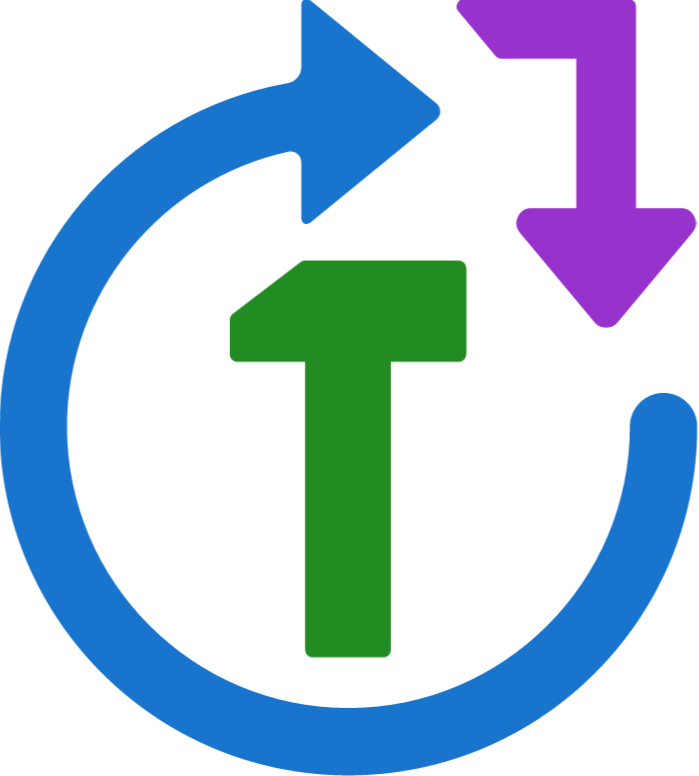

<h1 align="center">
  
</h1>

```{r, echo = F}
suppressMessages(suppressWarnings(library(drake)))
clean(T)
```

Drake is a workflow manager for R. When it runs a project, it automatically builds missing and outdated results while skipping over all the up-to-date output. This automation and reproducibility is important for data analysis workflows, especially large projects under heavy development.

# Acknowledgements and history

The original idea of a time-saving reproducible build system extends back decades to [GNU Make](http://kbroman.org/minimal_make/), which today helps [data scientists](http://blog.kaggle.com/2012/10/15/make-for-data-scientists/) as well as the original user base of complied-language programmers. More recently, [Rich FitzJohn](http://richfitz.github.io/) created [remake](https://github.com/richfitz/remake), a breakthrough reimagining of [Make](http://kbroman.org/minimal_make/) for R and the most important inspiration for drake. Drake is a fresh, minimalist reinterpretation of some of  [remake](https://github.com/richfitz/remake)'s pioneering fundamental concepts, scaled up for computationally-demanding workflows. Relative to [remake](https://github.com/richfitz/remake), some of drake's most prominent distinguishing features at the time of writing this document are

- a more convenient, R-focused, [YAML](http://yaml.org/)-free user interface.
- smoother user-side handling of external files and nested commands.
- **seamless** integration with [Makefiles](http://kbroman.org/minimal_make/) for built-in high-performance computing.
- a smaller, lighter backend.

Thanks also to [Kirill M&uuml;ller](http://krlmlr.github.io/) and [Daniel Falster](http://danielfalster.com/). They contributed code patches and enhancement ideas to my [parallelRemake](https://github.com/wlandau/parallelRemake) and [remakeGenerator](https://github.com/wlandau/remakeGenerator) packages, which I have now subsumed into drake.

# Rtools for Windows users

Windows users need [`Rtools`](https://cran.r-project.org/bin/windows/Rtools/) to run `make(..., makefile = TRUE)` (`system2("make")` needs to be possible).

# Help and troubleshooting

Use the `help_drake()` function to obtain a collection of helpful links. For troubleshooting, please refer to [TROUBLESHOOTING.md](https://github.com/wlandau-lilly/drake/blob/master/TROUBLESHOOTING.md) on the [GitHub page](https://github.com/wlandau-lilly/drake) for instructions.


# Basic usage

Drake was built to keep track of large and complicated statistical analysis workflows, but for now, let's start small. Here is a baby workflow plan to produce a variable named `a`.

1. Evaluate `1 + 1` and assign the result to variable `d`.
2. Evaluate `2 + 2` and assign the result to variable `e`.
3. Evaluate `3 + 3` and assign the result to variable `f`.
4. After we have `d` and `f`, evaluate `d + f` and assign the result to variable `c`.
5. After we have `d` and `e`, evaluate `d + e` and assign the result to variable `b`.
6. After we have `b` and `c`, evaluate `b + c` and assign the result to variable `a`.

We represent this plan in a data frame with code and output.

```{r}
library(drake)
x = example_plan("small")
x
```

Use `make()` to run the six steps in the correct order. Keep in mind that steps 1 through 3 can be interchanged and steps 4 and 5 can be interchanged.

```{r}
check(x) # check for errors first 
make(x)
readd(a) # see also loadd() and cached()
```

The whole point of drake is to **reproducibly track** your output. If an object is already up to date, drake will skip it next time.

```{r}
make(x, output = c("c", "f"))
```

When you change your code, drake brings your results up to date, doing the minimum amount of work necesary.. 

```{r}
x$code[3] = "sqrt(d) + 2*f + 1" # new code for variable c
make(x)
readd(a)
make(x)
x$code[5] = "2*2*1" # variable e: previously 2 + 2, so the output value doesn't change
make(x)
readd(a)
x$code[5] = "7/2" # new code for variable e
make(x)
readd(a)
x$code[5] = "7 /2 # changes to comments and whitespace are ignored"
make(x)
```

# Interacting with the cache

Try these functions in an interactive R session at the root directory of your project (or a subdirectory, with the `search` argument).

- `status()` returns the running build status of each object so far (`"skipped"`, `"built"`, `"imported"`, or `"IN PROGRESS"`). Unlisted objects were not yet reached by `make()`. If `make()` is interrupted or quits in error, any output that was being made at the time will still be labeled `"IN PROGRESS"`.
- `session()` returns the `sessionInfo()` from the last call to `make()`.
- `cached()` lists the objects in the cache.
- `built()` lists the built and cached objects from the workflow plan.
- `imported()` lists the cached dependencies were imported from `envir` or the calling environment (stay tuned).
- `readd()` returns an object from the cache.
- `loadd()` loads one or more objects from the cache into your workspace.
- `find_project()` returns the root directory of your drake project. Your current working directory needs to be inside your project..
- `find_cache()` shows the location of your project's hidden drake cache, which is a folder called `.drake/` at the root of your project. The cache was generated using [storr](https://github.com/richfitz/storr).

# Cleaning and pruning

Prune your worklfow to remove objects no longer in the plan.

```{r}
cached()
x = x[1:5,]
prune(x)
cached()
```

Use `clean()` to completely remove everything generated and tracked by `make()`. This is a nuclear option, so only use it if you are totally sure you want to start over from scratch.

```{r}
clean() # removes the cached objects but keeps the hidden ".drake/" folder
cached()
clean(destroy = TRUE) # removes ".drake/"
```

To use `prune()` and `clean()`, you must be in the project's root directory, which you can find with `find_project()`.


# Imported objects

The code in your workflow plan may depend on functions you write yourself, data that you download from a website before every runthrough, etc. Drake just pulls these objects from your workspace and reproducibly tracks them. Try `make(..., envir = my_workspace)` if you want to use a custom R environment instead. **WARNING: packages, global options, and other parts of the global environment are available, but NOT reproducibly tracked.** (Use [`packrat`](https://rstudio.github.io/packrat/) to reproducibly manage your packages.)

```{r}
x = data.frame(output = c("out", "my_input"), code = c("my_input - 1", "f(2)"))
f = function(x) g(x) + 1
g = function(x) h(x) + 2
h = function(x) x^2 + my_var
# make(x) # quits in error because "my_var" is undefined
my_var = 1
make(x)
readd(out)
make(x)
my_var = 2 # drake knows you changed "my_var"
make(x)
readd(out)
```

Drake knows when your functions change, and it respects how functions are nested. Here, `f()` calls `g()`, and `g()` calls `h()`. So if `h()` changes, then everything depending on `f()`
will be rebuilt.

```{r}
h = function(x){ x - 10 + my_var}
make(x)
readd(out)
```

But changes to comments and whitespace in functions are ignored.

```{r}
h = function(x){
  x-10+my_var
}
make(x)
readd(out)
```

## Caution about imported objects

I repeat: only your workspace is reproducibly tracked (or `envir` in `make()`).

```{r}
global = 10000
run = function(x) make(x)
run(x)
readd(out)
```

In addition, beware of automatically-loaded `'.RData'` files that could wreck your workspace. If you have an `'.RData'` file in your working directory, drake warns you on load.

```{r}
save.image()
drake:::.onLoad()
unlink('.RData')
```


# External files

```{r, echo = F}
clean()
rm(list = ls())
```

Sometimes character strings are just plain strings, but other times they are names of reproducibly-tracked files that your workflow depends on. Drake tells the difference with quoting. Double-quoted strings are ordinary strings, and strings wrapped in single quotes stand for file dependencies. Functions `as_file()`, `quotes()`, `strings()`, and `unquote()` ease some of the string-manipulation burden. (These last three are from the [eply](https://github.com/wlandau-lilly/eply) package.)

```{r}
saveRDS("imported data", file = "imported_file")
x = data.frame(
  output = c("'first'", "message", "'second'", "contents_of_imported_file"),
  code = c(
    "saveRDS(\"hello world\", \"first\")",
    "readRDS('first')",
    "saveRDS(message, \"second\")",
    "readRDS('imported_file')"))
x
```

In the first row, notice that `first` is single-quoted on the left and double-quoted on the right. This tells drake to expect an output file named `first`, which does not depend on the character string `"first"`. If double quotes were on the right side as well, the file `first` would depend on itself, and `make()` would quit in error. On the other hand, `message` uses a single-quoted `'first'` in its code, telling drake to treat the file `first` as an external file dependency.

Before you run your workflow, use `check()` to screen for circular dependencies, missing files, and possible mistakes in quoting. (`make()` checks the first two of these.)

```{r}
check(x)
make(x, output = "'second'") # Use single quotes here too.
make(x)
readRDS("second")
readd(contents_of_imported_file)
readd("'second'") # Only the fingerprints of external files are cached.
```

Both imported and output files are reproducibly tracked.

```{r}
make(x)
cached()
list.files()
```

Cleaning and pruning remove output files, but not imported input files.

```{r}
clean()
cached()
list.files()
unlink("imported_file")
```

If you damage or delete any output files, drake will recover them for you.

```{r}
file_plan = plan(list = c(
  "'a'" = "saveRDS(17, \"a\")",
  "'b'" = "saveRDS(1 + readRDS('a'), \"b\")",
  "c" = "readRDS('b')"))
file_plan
make(file_plan, verbose = FALSE) # first runthrough
readRDS('b')
saveRDS(5, 'b') # damage the file 'b'
make(file_plan)
readRDS('b')
clean()
```

**WARNING: drake does not look for file dependencies inside the bodies of imported functions.** Inside imported functions, single quotes are not given any special treatment. Single quotes are unavoidably turned into double quotes when a function is parsed or tidied, so if you import `f <- function(x) read.csv('my_file.csv')` from your calling environment, then `'my_file.csv'` will not necessarily be treated as a file dependency.

The `plan()` function errs on the side of single-quoting to make sure file dependencies are not forgotten. Still, you should always run `check()` before `make()`. Read on for more about `plan()`.


# More on workflow plans

Drake has a few built-in workflow plans.

```{r}
example_plans()
example_plan("small")
example_plan("debug")
```

The "debug" plan relies on external functions and files that you should load with `debug_setup()` before calling `make()`. When you're done, call `debug_cleanup()` to remove the files for the example.

Drake's `plan()` function helps create workflow plan data frames, and the `as_file()` function wraps strings in single quotes so drake can recognize them as file names. The [eply](https://github.com/wlandau-lilly/eply) package has functions `quotes()`, `strings()`, and `unquote()` to help with character manipulation and quoting. I stress: single-quoted strings denote file dependencies, and double-quoted strings are just ordinary character strings. The `plan()` function errs on the side of single-quoting to make sure file dependencies are not forgotten. For more control over quoting, either use the `strings_in_dots` argument or disregard the freeform dots `'...'` in favor of the `list` argument.

```{r}
plan(x = a, y = readRDS(2, 'input.rds'))
plan(x = a, y = readRDS(2, 'input.rds'), 
     strings_in_dots = "file_deps") # default
plan(x = a, y = readRDS(2, 'input.rds'), 
     strings_in_dots = "not_deps")
plan(x = a, y = readRDS(2, "input.rds"))
plan(x = a, y = readRDS(2, "input.rds"), 
     strings_in_dots = "not_deps")
plan(list = c(x = "a", y = "readRDS(\"some_string\", 'input.rds')"))
plan('a' = 1)
plan("'a'" = 1)
plan("'a'" = 1, strings_in_dots = "not_deps") # does not affect output names
# plan('"a"' = 1) # error: output names can't be double-quoted
```

The following demonstrates a common mistake. If you fail to enforce double-quoting below, then the file `'x'` will depend on itself, creating a vicious circularity. (Quoting is tricky because R unavoidably converts single quotes to double quotes when it parses/deparses expressions.)

```{r}
p = plan(x = saveRDS(1, "x"), y = saveRDS(2, "y"), file_outputs = TRUE)
p
# check(p) # quits in error
# make(p)  # quits in error
p = plan(x = saveRDS(1, "x"), y = saveRDS(2, "y"), 
         file_outputs = TRUE, strings_in_dots = "not_deps")
p
check(p)
```

More examples:

```{r}
as_file(letters[1:4])
a = 4
plan(list = c(x = a, "'file'" = "readRDS(2, 'input.rds')"))
library(eply) # for quotes(), strings(), and unquote()
quotes(1:5, single = TRUE)
unquote("'not_a_file'")
strings(these, are, strings)
```


# Expanding a workflow plan

## A realistic example

Let's turn to a more realistic workflow, the kind you might use for a statistical analysis. First we'll plan to generate a couple datasets with user-defined functions `my_large()` and `my_small()`.

```{r}
data = plan(large = my_large(), small = my_small())
```

We'll use these methods of analysis.

```{r}
methods = plan(reg = regression(..dataset..), 
rf = random_forest(..dataset..))
```

To apply each method to each dataset, expand out the `methods` data frame, where each dataset name substitutes `..dataset..` in turn.

```{r}
myanalyses = analyses(methods, data)
myanalyses
```

You can generate multiple summaries of each analysis.

```{r}
summary_types = plan(
  stats = summary_statistics(..analysis..),
  error = mean_squared_error(..analysis.., ..dataset..))
mysummaries = summaries(summary_types, analyses= myanalyses, datasets = data)
mysummaries[3:10,]
```

Summaries are grouped together which is convenient for post-processing. (See the `gather` argument.)

```{r}
mysummaries[1:2,]
```

Some external file outputs may follow.

```{r}
out = plan(my_table.csv = save_summaries(stats),
           my_plot.pdf = plot_errors(error), file_outputs = TRUE)
```

If you have dynmaic [knitr](https://yihui.name/knitr/) reports at the very end (say, `my_report.Rmd`), you will need to manually declare any dependencies loaded into code chunks with `loadd()` or `readd()`. This ensures that the reports are rebuilt when their dependencies change.

```{r}
report_depends = plan(deps = c(stats, error))

reports = plan(
  my_report.md = my_knit('my_report.Rmd', deps),
  my_report.html = my_render('my_report.md', deps),
  file_outputs = TRUE)
reports
```

where 

```{r}
my_knit = function(file, ...) knitr::knit(file)
my_render = function(file, ...) rmarkdown::render(file)
```


Finally, gather all your commands into a single data frame and run the project.

```{r}
my_plan = rbind(data, myanalyses, mysummaries, out, 
  report_depends, reports)
tmp = file.create("my_report.Rmd") # You would write this by hand.
check(my_plan)
# make(my_plan)
tmp = file.remove("my_report.Rmd")
```


## More flexibility for generating workflow plans


If your workflow does not fit the rigid datasets/analyses/summaries framework, check out functions `expand()`, `evaluate()`, and `gather()`.

```{r}
df = plan(data = simulate(center = MU, scale = SIGMA))
df
df = expand(df, values = c("rep1", "rep2"))
df
evaluate(df, wildcard = "MU", values = 1:2)
evaluate(df, wildcard = "MU", values = 1:2, expand = FALSE)
evaluate(df, rules = list(MU = 1:2, SIGMA = c(0.1, 1)), expand = FALSE)
evaluate(df, rules = list(MU = 1:2, SIGMA = c(0.1, 1, 10)))
gather(df)
gather(df, output = "my_summaries", gather = "rbind")
```

# High-performance computing

## Parallel processes with Makefiles

As advertised, drake seamlessly integrates with [Makefiles](http://kbroman.org/minimal_make/) for high-performance computing. If [Rtools](https://cran.r-project.org/bin/windows/Rtools/) is installed on your system, `make(..., makefile = TRUE, command = "make", args = "--jobs=4")` will create a [Makefile](http://kbroman.org/minimal_make/) and then use it to distribute the build steps over four parallel R sessions. (Use `run = F` to just write the [Makefile](http://kbroman.org/minimal_make/) and not build any outputs.) Try the following yourself.

```r
library(drake)
plan = example_plan("debug")
debug_setup()
make(plan, makefile = TRUE, command = "make", args = "--jobs=4")
make(plan, makefile = TRUE, command = "make", args = "--jobs=4")
g = function(x){
  h(x) + i(x) + 1
}
make(plan, makefile = TRUE, command = "make", args = "--jobs=4")
```

As the above code demonstrates, [Make](http://kbroman.org/minimal_make/) acts as more than just a job scheduler. Just like regular `drake::make()`, the [Makefile](http://kbroman.org/minimal_make/) knows what can safely be skipped. The detection of the required build steps happens in an initialization step in R that must be repeated at the beginning of every runthrough, which means **the [Makefile](http://kbroman.org/minimal_make/) is not standalone. You must only run the [Makefile](http://kbroman.org/minimal_make/) using `make(..., makefile = TRUE)` in an interactive R session, `Rscript`, `R CMD BATCH`, or something similar. Do not invoke `make` directly in the Linux command line.**

The `command` argument lets you to micromanage how you call [Makefile](http://kbroman.org/minimal_make/), keeping in mind that the [Makefile](http://kbroman.org/minimal_make/) will be in your working directory. For example, `make(..., makefile = T, command = "make", args = c("--jobs=8", "-s"))` distributes the work over 8 parallel jobs and suppresses verbose console output from [Make](http://kbroman.org/minimal_make/). On [LSF systems](https://en.wikipedia.org/wiki/Platform_LSF), you could even replace `"make"` with [lsmake](https://www.ibm.com/support/knowledgecenter/SSETD4_9.1.3/lsf_admin/lsmake_how_works_lsf.html) in your `command`.

To use packages and global options in your [Makefile](http://kbroman.org/minimal_make/)-accelerated workflow, you need to use the `packages` and `global` arguments in `make()`. The `packages` argument defaults to `loadedNamespaces()`, so calling `library()` before `make()` should be sufficient most of the time. If you need to control the order that your packages load in the individual build steps, use `packages` to list your packages from first to last. The code in `global` can also be used to load packages, but its main purpose is to set up anything else that needs to be in the global environment, such as global options. All the code chunks in `global` are run in the global environment before individual build steps. **Similarly to before, the effects of `packages` and `global` are not reproducibly tracked**.

To prepend lines of code to your [Makefile](http://kbroman.org/minimal_make/), use the `prepend` argument to `make()`. This can be used to write comments, define variables, and connect your work to a formal job scheduler, cluster, or supercomputer. Which leads us to...


## Distributed computing on a cluster or supercomputer

If you want to distribute your work over multiple nodes of a [Slurm](http://slurm.schedmd.com/) cluster, you can create a  [Makefile](http://kbroman.org/minimal_make/) using the solution in [this post](http://plindenbaum.blogspot.com/2014/09/parallelizing-gnu-make-4-in-slurm.html).
The following command submits jobs to [Slurm](http://slurm.schedmd.com/) to build individual outputs, with at most 8 jobs running simultaneously.

```r
make(..., makefile = TRUE, command = "make", args = "--jobs=8",
  prepend = c(
    "SHELL = srun",
    ".SHELLFLAGS = <ARGS> bash -c"))
```

To make sure your work keeps running after you log out, save your R code to a file (say, `my_file.R`) and then run the following in the [Linux command line](http://linuxcommand.org/).

```r
nohup nice -19 R CMD BATCH my_file.R &
```

For job schedulers other than [Slurm](http://slurm.schedmd.com/), you  may have to create a custom stand-in for a shell. For example, suppose we are using the [Univa Grid Engine](http://www.univa.com/products/). Your `my_file.R` should end with the following.

```r
make(.., makefile = TRUE, args = "--jobs=8", prepend = "SHELL = ./shell.sh")
```

where the file `shell.sh` contains

```r
#!/bin/bash
shift
echo "module load R; $*" | qsub -sync y -cwd -j y
```

Now, in the [Linux command line](http://linuxcommand.org/), enable execution with

```r
chmod +x shell.sh
```

and then run as before with

```r
nohup nice -19 R CMD BATCH my_file.R &
```

Regardless of the system, be sure that all nodes point to the same working directory so that they share the same `.remake` [storr](https://github.com/richfitz/storr) cache. Do this with your `shell.sh`. For the Univa Grid Engine, for example, use the `-cwd` flag for `qsub`.

```{r echo=F}
clean(destroy = TRUE)
```
